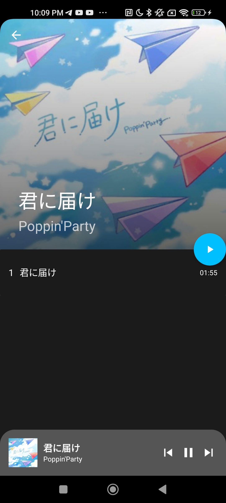
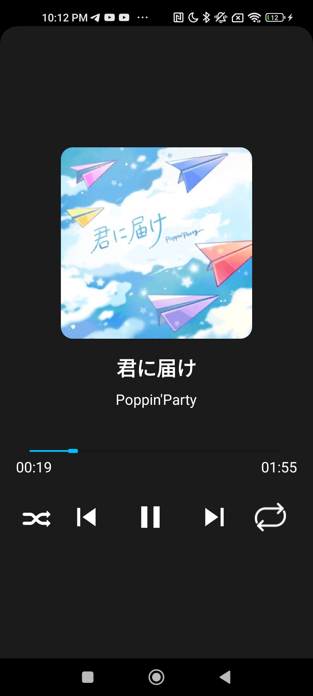
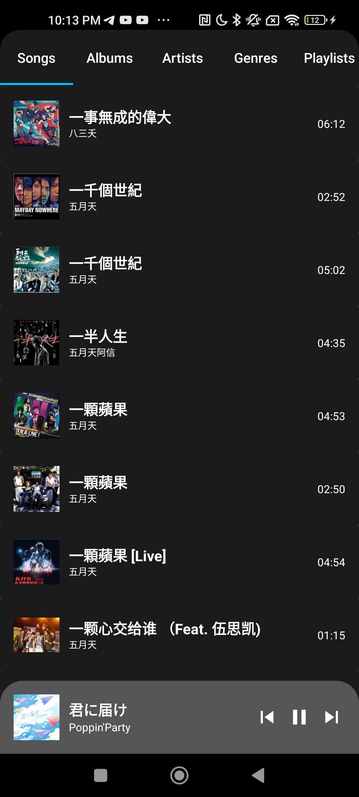

# Music Player

Its a sad music player that i made to learn a lot of android stuff which includes
* Services
* Media Player/Media Session/MediaBrowserSession
* Cache storage
* Recyclerview
* Coordinator Layout
* Content Provider
* Constrant layout
* Dialogs
* Single Activity + a lot of fragments
* a lot of data storage ideas
* A lot on android activity/fragment/services lifecycle

## Known Bugs/ Issues
* Playlist screen turns blank upon deleting a playlist
  * To workaround, switch to songs screen then swutch back to playlist screen

If u guys see any bugs that are not listed here, feel free to open an issue :D

Hiiii guys I am pretty much done with this app, any features that you wish to add in the app, feel free to open an issue and I will try to add it though it will be pretty slow because I have fyp to do T.T

## Screenshots

 
  
 

 
